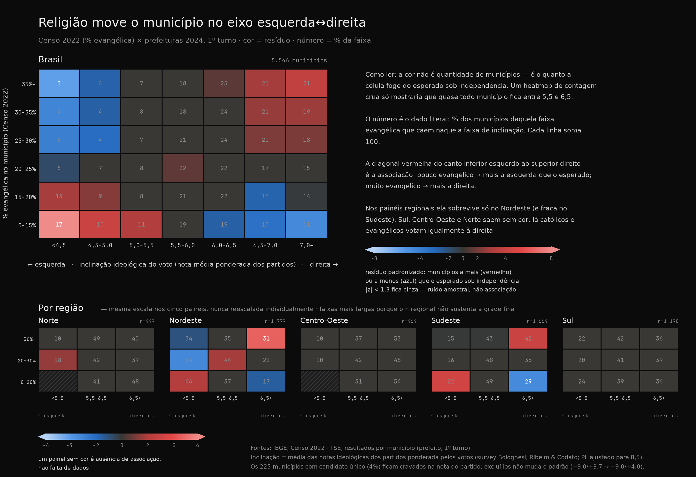
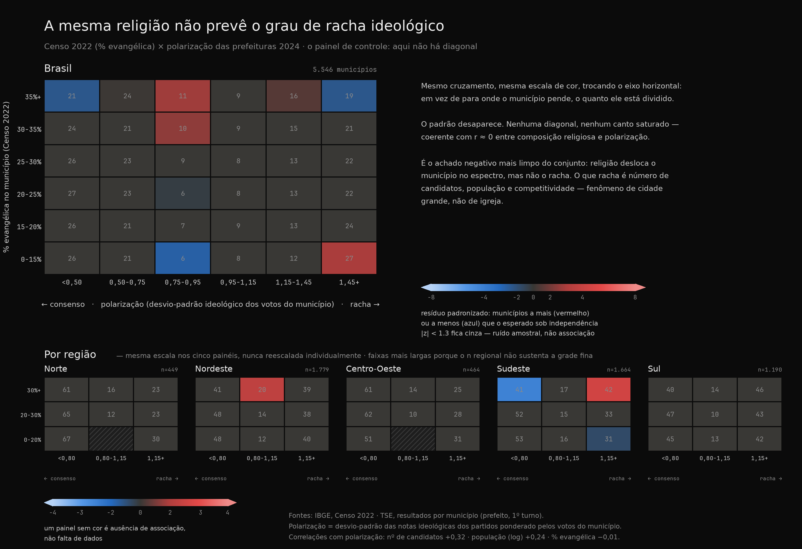

# Religião × Polarização política nos municípios (2024 × Censo 2022)

Cruzamento do mapa de **inclinação/polarização das prefeituras 2024** (1º turno, TSE, voto
ponderado pela nota ideológica do partido de cada candidato) com o **perfil religioso do
Censo 2022** (IBGE). Junção por `UF + nome normalizado`: **5.546 de 5.557** municípios
casaram (11 perdidos por grafia).

**Mapas interativos:**
[Prefeitos 2024 — Esquerda × Direita](https://xn--2dk.xyz/dataviz/eleicoes) ·
[Perfil Religioso dos Municípios](https://xn--2dk.xyz/dataviz/religioes) ·
[Igrejas Geolocalizadas](https://xn--2dk.xyz/dataviz/religioes/igrejas)

> **Nota de versão.** As notas ideológicas usam o survey de especialistas de Bolognesi,
> Ribeiro & Codato, com **um override**: o **PL → 8,5** (mais à direita que o NOVO, 8,2),
> porque o survey é de 2018, antes de o PL virar a legenda do bolsonarismo. Como o PL é o
> maior partido em votos (15,6M), esse ajuste desloca perceptivelmente a cauda direita.
> Detalhes em `../metodologia.md`.

---

## 1. Religião prediz o *lado*, não a *intensidade*

A composição religiosa se correlaciona com **para onde** o município pende — mas **não** com
o quão dividido/polarizado ele é.

| correlação (n=5.546) | com **inclinação** (dir+) | com **polarização** |
|---|---:|---:|
| **% evangélica** | **+0,214** | −0,01 |
| **% católica** | **−0,180** | −0,01 |
| % espírita | +0,074 | — |
| % sem religião | +0,033 | +0,06 |
| % umbanda/candomblé | −0,005 | — |

Mais evangélicos → mais à direita; mais católicos → mais à esquerda. Mas **nenhuma**
religião prevê polarização (todos os `r` ≈ 0). **A religião move o eixo esquerda↔direita,
não o grau de racha ideológico** — o achado "negativo" mais limpo do conjunto (ver §6 para
o que *de fato* move a polarização).

## 2. O gradiente: a esquerda some antes de a direita crescer

Municípios ordenados por % evangélica, em quintis:

| faixa evangélica | evang. média | inclinação | % voto **direita** | % voto **esquerda** |
|---|---:|---:|---:|---:|
| 1–13% | 10,0% | 5,64 | 34,2% | **23,8%** |
| 13–19% | 16,3% | 5,82 | 36,5% | 19,0% |
| 19–25% | 21,7% | 6,02 | 40,2% | 14,6% |
| 25–31% | 27,9% | 6,23 | 46,7% | 10,9% |
| **31–89%** | 38,4% | 6,28 | **49,8%** | **11,0%** |

Do quintil menos ao mais evangélico, o voto de direita sobe +16pp (34→50%) e o de esquerda
**cai pela metade** (24→11%). O efeito é mais um **recuo da esquerda** em território
evangélico do que uma explosão da direita (que já era maioria em quase todo lugar).

O mesmo gradiente visto como distribuição conjunta. **A cor não é contagem de municípios** —
é o resíduo padronizado, o quanto cada célula foge do esperado se religião e voto fossem
independentes; um heatmap de densidade crua só mostraria que quase todo município fica entre
5,5 e 6,5. O número dentro da célula é o dado literal (% da faixa evangélica, cada linha
soma 100). Células com |z| < 1,3 ficam cinza: é ruído amostral, não associação.

Duas coisas que a tabela acima não mostra. Primeiro, a **assimetria** do §2 aparece na
intensidade: o canto inferior-esquerdo (pouco evangélico, esquerda dura) é a célula mais
saturada do painel — z = +9,0, de longe o maior desvio da grade —, enquanto o canto
direito cresce de forma bem mais modesta. O que a religião prevê com força é a **presença da
esquerda**, não a da direita. Segundo, os painéis regionais são o §3 renderizado: a diagonal
sobrevive no **Nordeste** e no **Sudeste** e **some por completo no Sul e no Centro-Oeste**,
que saem cinza. Os cinco painéis dividem uma escala de cor fixa — um painel sem cor é
ausência de associação, não falta de dados.

## 3. Metade disso é geografia (mas não toda)

Confundidor: o **Nordeste** é ao mesmo tempo mais católico e mais à esquerda (redutos do
PT); **Norte/Centro-Oeste** são mais evangélicos e mais à direita. Testando a correlação
evangélico→direita **dentro** de cada região:

| região | r(evang, lean) |
|---|---:|
| **Nordeste** | **+0,159** |
| Sudeste | +0,112 |
| Norte | +0,088 |
| Centro-Oeste | +0,032 |
| Sul | +0,032 |

O `r` nacional (+0,214) não só encolhe dentro das regiões — ele **desaparece no Sul e no
Centro-Oeste**, e o sinal do católico chega a **inverter** (r=+0,03): lá o município é ao
mesmo tempo muito católico (72,6% no Sul) *e* de direita (lean 6,17). A clivagem
religião↔política é, na prática, um **fenômeno do Nordeste** (e em parte do Sudeste), onde a
base católica popular sustenta o PT; **não é uma lei nacional**. No Sul, católico
colonial-conservador (herança ítalo-alemã) e evangélico votam igualmente à direita.

### 3b. Não é o *tipo* de evangélico (teste da hipótese luterana)

Hipótese natural para o Sul: seus evangélicos seriam mais **históricos/de missão**
(luteranos IECLB) e menos pentecostais, logo menos bolsonaristas. Os dados de templos
geolocalizados (mapa de igrejas, ~574k templos classificados por vertente) **não sustentam**:

| | r(**fração pentecostal** dos templos, lean) | r(% evang, lean) |
|---|---:|---:|
| Brasil | **−0,02** | +0,24 |
| Nordeste | −0,11 | +0,17 |
| Sul | −0,09 | +0,03 |
| Sudeste | +0,00 | +0,13 |

- **O Sul não é distintamente "de missão":** 16,7% dos templos evangélicos são de missão vs
  71,3% pentecostais — praticamente igual ao resto do país (o Nordeste é o *mais* de missão,
  20,3%).
- **A fração pentecostal não prevê voto de direita em lugar nenhum** (r≈−0,02, até levemente
  negativo). O que correlaciona (fracamente) é a *quantidade* de evangélicos, não o *tipo*.

*Ressalva:* isso conta **templos, não fiéis**. Igreja luterana é grande e escassa; pentecostal
é pequena e numerosa — então a contagem de templos subestima o peso luterano no Sul. Não é
uma rejeição definitiva, mas a explicação mais econômica não é o tipo de evangélico, e sim
que **o Sul vota à direita em bloco, independentemente de religião** — provavelmente um
contraste de *tipo de católico* (nordestino popular vs sulista colonial-conservador).

## 4. Perfil por região

| região | n | pop % | evang. | catól. | sem rel. | inclin. | polariz. | % dir | % esq |
|---|--:|--:|--:|--:|--:|--:|--:|--:|--:|
| Norte | 449 | 8% | 34,1% | 55,8% | 7,0% | 6,30 | 0,79 | 55% | 8% |
| Nordeste | 1.779 | 27% | 17,5% | 73,9% | 6,2% | **5,51** | 0,99 | 32% | **27%** |
| Centro-Oeste | 464 | 7% | 29,5% | 59,2% | 7,1% | **6,48** | 0,80 | 58% | 8% |
| Sudeste | 1.664 | 43% | 24,9% | 65,1% | 5,6% | 6,18 | 0,92 | 42% | 10% |
| Sul | 1.190 | 15% | 21,3% | 72,6% | **3,2%** | 6,17 | **1,01** | 44% | 14% |

O Nordeste é a única região à esquerda do centro (5,51) e a única onde o voto de esquerda
(27%) rivaliza com o de direita. Centro-Oeste é o mais à direita (6,48). O Sul combina
alta religiosidade católica, baixíssima secularização (3,2%) e a maior polarização média.

## 5. Nos redutos evangélicos, a esquerda quase não existe

Nos **345 municípios com >40% de evangélicos**: inclinação média 6,35, voto de direita
52,6%, **voto de esquerda só 10,1%**. Prefeitos eleitos:

> MDB 70 · PP 56 · União 52 · PL 48 · PSD 31 · Republicanos 27 — quase tudo centrão/direita.

Espelho: onde a **esquerda venceu a prefeitura** (752 municípios), a população é mais
**católica** (72,8% vs 67,6%) e menos **evangélica** (19,4% vs 23,4%) que a média.

## 6. O que *realmente* move a polarização: cidade, não igreja

A polarização ideológica não tem a ver com religião — é **estrutural e urbana**:

| correlação com **polarização** | r |
|---|---:|
| nº de candidatos | **+0,319** |
| margem 1º–2º | **−0,267** |
| população (log) | **+0,237** |
| % evangélica | −0,012 |
| % sem religião | +0,059 |

Mecânica clara pelo nº de candidatos: **1 candidato → 0,00 · 2 → 0,86 · 3 → 1,04 · 4 → 1,16
· 5 → 1,32 · 6+ → 1,46.** Mais candidatos (e mais eleitores) abrem espaço para nomes em
pontos distintos do espectro. Onde há dois nomes do mesmo campo, a disputa pode ser
acirrada (margem baixa) sem ser ideologicamente polarizada.

**Capitais polarizam quase o dobro do interior (1,79 vs 0,94)** — e pendem levemente mais à
esquerda (5,90 vs 6,00). A metrópole racha; o interior consolida.

O painel de controle, para o §1: exatamente o mesmo cruzamento e a mesma escala de cor,
trocando o eixo horizontal de *para onde o município pende* para *o quanto ele está
dividido*. A diagonal desaparece — sobram células isoladas, sem gradiente e sem canto
saturado. Vale como leitura negativa da figura do §2: aquela diagonal é sinal, não um
artefato do método de binagem ou da escala de cor, porque o mesmo método aplicado a uma
variável sem associação produz cinza.

| capital | inclin. | polariz. | evang. | venceu |
|---|--:|--:|--:|---|
| Recife/PE | 4,38 | 1,82 | 28% | PSB |
| Porto Alegre/RS | 4,46 | 1,63 | 13% | MDB |
| Florianópolis/SC | 4,76 | 2,04 | 14% | PSD |
| São Paulo/SP | 4,90 | **2,65** | 23% | MDB |
| Fortaleza/CE | 5,57 | **2,78** | 26% | PL |
| Rio de Janeiro/RJ | 6,54 | 1,65 | 25% | PSD |
| Belo Horizonte/MG | 6,61 | 1,79 | 27% | PL |
| Rio Branco/AC | 7,35 | 1,47 | 47% | PL |
| Maceió/AL | **7,91** | 1,48 | 30% | PL |

*(26 capitais casadas; recorte acima ilustra os extremos.)* Fortaleza e São Paulo são as
mais rachadas do país entre grandes cidades; Maceió e Rio Branco, as mais à direita.

## 7. O que pesa é o *nível*, não a *velocidade* de conversão

O crescimento evangélico 2010→2022 mal se correlaciona com inclinação (≈+0,05) e é até
levemente negativo com polarização (≈−0,06): municípios que **mais** se converteram na
década não são mais à direita nem mais divididos. O que alinha com a direita é já **ser**
evangélico, não estar virando.

## 8. Extremos nomeados

- **Mais à direita (lean 8,5):** dezenas de municípios com candidatura única do **PL** e
  100% dos votos (ex.: Bom Jesus de Goiás/GO, Chácara/MG, Bela Vista do Paraíso/PR).
- **Mais à esquerda (lean 2,5):** municípios com PT único (ex.: Rio Doce/MG, Bela Vista do
  Piauí/PI, vários no interior gaúcho católico).
- **Mais polarizados:** Pedro do Rosário/MA (3,20), Santo Antônio dos Lopes/MA (3,12),
  Gentil/RS (3,00) — disputas com muitos candidatos de campos opostos.

---

## Síntese

1. **Existe** clivagem religião↔política real e na direção esperada (evangélico↔direita,
   católico↔esquerda), de **magnitude modesta** — longe de determinística.
2. O efeito é **regional, não nacional**: existe no Nordeste (e em parte no Sudeste) e
   **some no Sul e Centro-Oeste**, onde católicos e evangélicos votam igualmente à direita.
   Não é o *tipo* de evangélico (a fração pentecostal não prevê o voto — §3b); é que o Sul é
   politicamente homogêneo à direita. "Católico = esquerda" é fenômeno nordestino.
3. **Religião não gera polarização.** Ela desloca o município no espectro; o racha
   ideológico é dirigido por **número de candidatos, população e competitividade** — é um
   fenômeno de **cidade grande**, não de igreja.

## Ressalvas

- **Falácia ecológica:** correlação entre agregados municipais ≠ comportamento individual.
  Não se conclui daqui "o evangélico vota à direita" — só que *municípios* mais evangélicos
  *tendem* a votar mais à direita.
- **Notas de especialistas**, não verdade objetiva; herdadas do partido, não do candidato.
  Prefeitura é eleição personalista → sinal ruidoso por construção. O override do PL (§nota)
  é uma escolha editorial explícita e auditável.
- **Janelas temporais** próximas mas distintas: Censo 2022, eleição 2024.
- Correlações são de força **fraca a moderada** (|r| ≤ 0,3); descrevem tendência, não
  poder preditivo forte.

---

*Fontes: TSE `br_tse_eleicoes.resultados_candidato_municipio` (2024, prefeito, 1º turno);
IBGE Censo 2022 (perfil religioso); centroides `br_bd_diretorios_brasil.municipio`. Query e
notas partidárias reprodutíveis em `../dados/query.sql` e `../metodologia.md`. A junção,
as correlações deste relatório e as duas figuras saem de
`../heatmap_religiao_x_lean.py` (`python3 eleicoes/heatmap_religiao_x_lean.py`), que
imprime os `r` de §1, §3 e §6 para conferência.*
