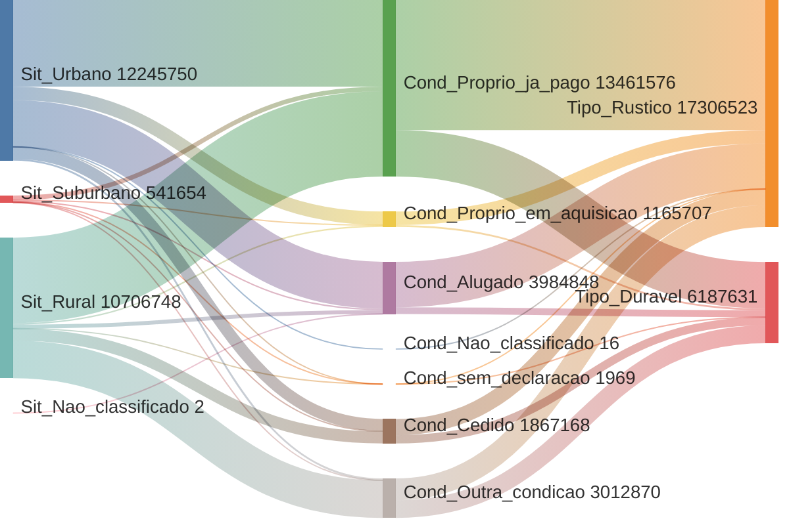
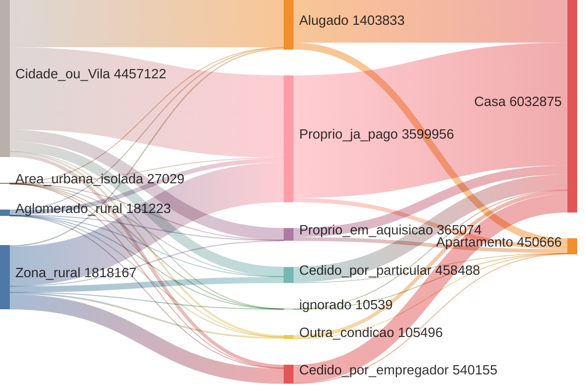

**🗺️ Exploring New Cartographic Technologies**

Today, through a screen, an individual can interrelate, interact, represent and navigate among millions of data points. Technological advances have drastically expanded our capacity to map territories, networks and flows.

The image below is not an aerial photo: it is a visual representation of Rio de Janeiro, where each illuminated point is a Legal Entity establishment.

---

**📊 Data Visualizations**

**Rio de Janeiro Business Network**

🔗 [Interactive Map: Rio de Janeiro Establishments](https://xn--2dk.xyz/dataviz/rio/ibge)

> *Visual representation of Rio de Janeiro where each illuminated point represents a registered business establishment*

---
![][image1]![][image2]
---

**All Churches in the Country**
> *Comprehensive mapping of religious institutions across Brazil, showing distribution patterns and density*

---
![][image3]![][image4]![][image5]![][image6]![][image7]
---

**More Churches Than Schools 😔**
> *Comparative analysis revealing the disproportionate number of religious institutions versus educational facilities*

---
![][image8]
---

**Residential Areas in Nova Friburgo with Height Relative to Number of Residents**
> *3D visualization showing population density through building height representation in Nova Friburgo*

---
![][image9]
---

🔗 [Interactive 3D Map: Nova Friburgo Population](https://xn--2dk.xyz/dataviz/friba/pop_3d)

**Distribution of Garment Companies**
> *Mapping of textile and clothing companies based on active business registrations (CNPJs)*

---
![][image10]

---

**Garment Companies Opened and Closed During Pandemic**
> *Analysis of business dynamics in the intimate apparel industry hub during COVID-19*

---
![][image12]
---

**All Residences in Nova Friburgo Municipality**
> *Complete residential mapping showing housing distribution patterns across the city*

---
![][image13]
---

**Religious Entities Outnumber Labor Unions in 2000**
> *Historical comparison showing the predominance of religious organizations over workers' unions*

---
![][image14]
---

**Heatmap of New Business Registrations in Nova Friburgo**
> *Temporal and spatial analysis of entrepreneurial activity and business creation patterns*

---
![][image15]
---

**Religious Affiliation by Municipality**
> *The more yellow, the more Catholic a municipality. Purple tends to be Evangelical*

---
![][image16]

![][image17]
---

**81.5% of Brazilian States Have Double the Religious Establishments Compared to Health Units**
> *Stark comparison highlighting the imbalance between religious institutions and healthcare facilities*

---
![][image18]
---

**Distribution of School Types in Rio (Primary, Secondary...)**
> *Educational infrastructure mapping showing the distribution of different educational levels*

---

![][image20]

**Biggest companies in the Country per State**
🔗 [Interactive Treemap](https://xn--2dk.xyz/dataviz/rais/por_uf)
![][pvt_por_uf]

**Investigating Societal relations**
🔗 [Interactive Societal Investigation](https://rafapolo.github.io/fincrime/)
![][reag-viz]

---

**Which Economic Sectors Closed After Others During the Pandemic?**
> *Sequential analysis of business closures by economic sector during COVID-19*

---
![][image22]
---

**Corporate Relationships of Friburgo Entrepreneurs with Multiple Companies**
> *Network analysis revealing business interconnections and corporate relationships*

---
![][image23]
---

**Heat Map of Areas with Most Residences**
> *Density visualization highlighting residential concentration zones*

---
![][image25]
---

**Companies and Partners of the "Tiger Game" Owner**
> *Corporate network analysis of gambling platform ownership structures*

---
![][image26]![][image27]![][image28]![][image29]
---

🔗 [Detailed Network Analysis: Tiger Game Footprints](https://tinyurl.com/pegadas-tigrim)

**Corporate Structure Visualization of a Specific Senator**
> *Political-business network mapping showing corporate connections and influence patterns*

---
![][image30]
---

**Swiss Companies with Headquarters in Brazil**
> *International business presence analysis showing foreign investment patterns*

---
![][image31]
---

🔗 [Swiss-Brazilian Business Network](https://tinyurl.com/swiss-brazilian-network)

---

**📈 IBGE Housing Census Data: Four Decades of Evolution (1970-2010)**
🔗 [Source Repository: IBGE Housing Census Analysis](https://github.com/rafapolo/IBGE13/)
> *Comprehensive Sankey flow diagrams showing Brazilian housing patterns across five census periods, revealing the transformation of housing ownership, urbanization trends, and dwelling characteristics over 40 years*

**1970 Housing Census**
> *Post-industrialization era housing patterns showing the dominance of rural owned properties and rustic housing types*

---

**1980 Housing Census**
> *Beginning of major urbanization: emergence of apartment living and shift from rural to urban settlements*

---

**Key Insights from Four Decades of Housing Evolution**

**Major Trends Observed:**
- **Urbanization Acceleration**: Massive shift from rural to urban housing (1970-2010)
- **Homeownership Growth**: Increase in fully owned properties vs. rentals
- **Housing Diversification**: From basic rural/urban to complex categorizations including condominiums
- **Social Recognition**: Inclusion of indigenous housing and institutional living categories
- **Economic Development**: Shift from "fully paid" to "in acquisition" reflecting credit access

---

**🔧 Technical Stack & Data Sources**

**Data Sources:**
- IBGE Census (Brazilian Institute of Geography and Statistics)
- CNEFE (National Registry of Addresses for Statistical Purposes)
- Federal Revenue Registry
- TSE (Superior Electoral Court)
- Chamber of Deputies Expense Records

---

**ミ ~ 2025**

[image1]: /images/image1.png
[image2]: /images/image2.png
[image3]: /images/image3.png
[image4]: /images/image4.png
[image5]: /images/image5.png
[image6]: /images/image6.png
[image7]: /images/image7.png
[image8]: /images/image8.png
[image9]: /images/image9.png
[image10]: /images/image10.png
[image12]: /images/image12.png
[image13]: /images/image13.png
[image14]: /images/image14.png
[image15]: /images/image15.png
[image16]: /images/image16.png
[image17]: /images/image17.png
[image18]: /images/image18.png
[image20]: /images/image20.png
[image22]: /images/image22.png
[image23]: /images/image23.png
[image25]: /images/image25.png
[image26]: /images/image26.png
[image27]: /images/image27.png
[image28]: /images/image28.png
[image29]: /images/image29.png
[image30]: /images/image30.png
[image31]: /images/image31.png
[pvt_por_uf]: /images/pvt_por_uf.png
[reag-viz]: /images/reag-viz.png
