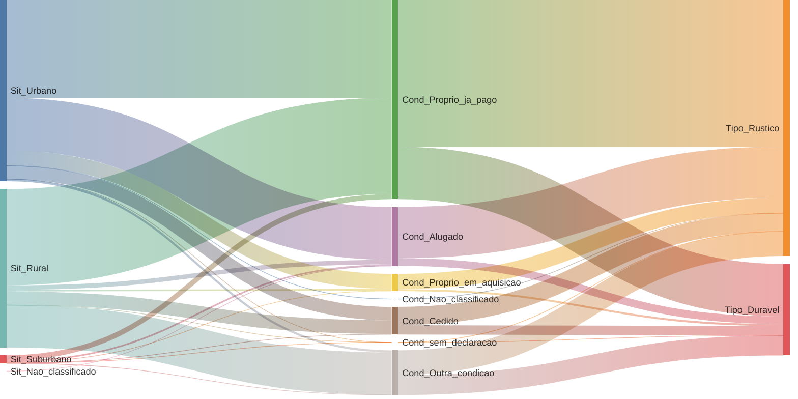
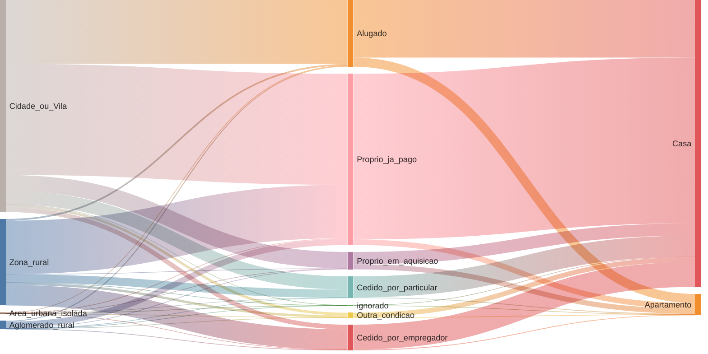
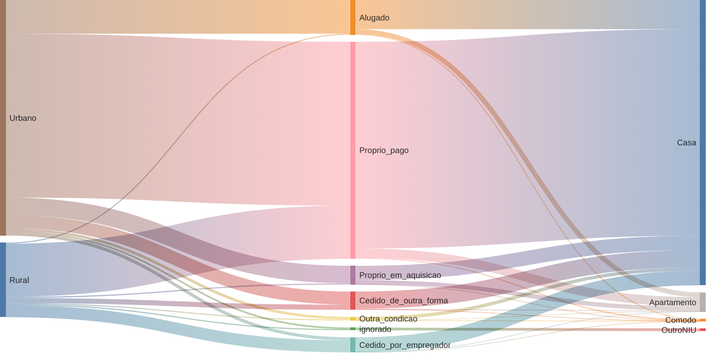

**ミxplorando Novas Tecnologias Cartográficas**

Hoje, através de uma tela, um indíviduo pode inter-relacionar, interagir, representar e navegar entre milhões de dados. O avanço nas tecnologias ampliou drasticamente nossa capacidade de mapear o território, as redes e os fluxos.

Experimentamos visualizar dados públicos, integrando os Censos do IBGE, o CNEFE e o Cadastro da Receita Federal, envolvendo:

- dados populacionais por perfil religioso, escolaridade, cor, idade...;
- empresas com atividades econômicas, sociedades, organizações religiosas, batalhões, prefeituras, comunidades quilombolas, bancos... a maioria com localização geográfica;
- potencialmente co-relacionados com o TSE, Despesas da Câmara, Frentes, Emendas PIX...

Demonstrando em pulos, a imagem abaixo não é uma foto aérea: é uma representação visual do Rio de Janeiro, onde cada ponto iluminado é um estabelecimento de Pessoa Jurídica;

\=\> [https://ミ.xyz/dataviz/rio/ibge](https://xn--2dk.xyz/dataviz/rio/ibge)

![][image1]![][image2]

**Todas as Igrejas do País**
![][image3]![][image4]![][image5]![][image6]![][image7]

**Mais igrejas que escolas. :/**
![][image8]

**Residenciais em Nova Friburgo com Altura relativa a número de moradores**
![][image9]
\=\> [https://ミ.xyz/dataviz/friba/pop\_3d](https://xn--2dk.xyz/dataviz/friba/pop_3d)

**Distribuição de Confecções (mapeado a partir dos CNPJs ativos)**

**![][image10]**

**Visualizando Confecçoes Abertas e Fechadas na Pandemia no pólo de moda intima**

**![][image12]**

**Todas as Residências no Município de Nova Friburgo**
![][image13]

**Número de Entidades Religiosas supera o de Sindicatos no ano 2000**
![][image14]

**Heatmap de registros de novas Empresas em Nova Friburgo**
![][image15]

**Quanto mais amarelo, mais Católico um município. Roxo tende a ser Evangélico.**

![][image16]
![][image17]

**81,5% dos estados brasileiros têm o dobro de estabelecimentos religiosos comparado a unidades de saúde.**![][image18]

**Distribuição de Tipo de Escolas no Rio (primário, secundária…)**
![][image19]

![][image20]

**Que áreas econômicas fecharam depois de outras durante a pandemia?**
![][image22]

**Relação Societária de Empresários Friburguenses com mais empresas**
![][image23]

**Mapa de calor de áreas com mais Residências**
![][image25]![][image26]![][image27]![][image28]

**Empresas e Sócios do dono do Jogo do Tigrinho**
\=\> [https://tinyurl.com/pegadas-tigrim](https://tinyurl.com/pegadas-tigrim)

![][image29]

**Visualização das Sociedades e Empresas de um determinado Senador**
**![][image30]**

**Empresas Suíças com sede no Brasil**
\=\> [https://tinyurl.com/swiss-brazilian-network](https://tinyurl.com/swiss-brazilian-network)

**![][image31]**

---

**📈 Dados dos Censos Habitacionais do IBGE: Quatro Décadas de Evolução (1970-2010)**

> *Diagramas de fluxo Sankey abrangentes mostrando os padrões habitacionais brasileiros ao longo de cinco períodos censitários, revelando a transformação da propriedade habitacional, tendências de urbanização e características das moradias durante 40 anos*

**Censo Habitacional de 1970**
> *Padrões habitacionais da era pós-industrialização mostrando o domínio de propriedades rurais próprias e tipos de habitação rústica*

---

**Censo Habitacional de 1980**
> *Início da grande urbanização: emergência da vida em apartamentos e mudança de assentamentos rurais para urbanos*

---

**Censo Habitacional de 2000**
> *Era do milênio: classificação urbano/rural simplificada mostrando a consolidação da vida urbana e cultura de apartamentos*

---

**Principais Insights de Quatro Décadas de Evolução Habitacional**

**Principais Tendências Observadas:**
- **Aceleração da Urbanização**: Mudança massiva de habitação rural para urbana (1970-2010)
- **Crescimento da Propriedade**: Aumento em propriedades quitadas vs. aluguéis
- **Diversificação Habitacional**: De classificação rural/urbana básica para categorizações complexas incluindo condomínios
- **Reconhecimento Social**: Inclusão de habitação indígena e categorias de moradia institucional
- **Desenvolvimento Econômico**: Mudança de "quitado" para "em aquisição" refletindo acesso ao crédito

🔗 **[Repositório Fonte: Análise dos Censos Habitacionais IBGE](https://github.com/rafapolo/IBGE13/)**

---

(Drucker, 2011) A cartografia digital permite espacializar saberes complexos — como padrões econômicos, práticas religiosas, ou redes de poder — que antes ficavam dispersos ou ocultos nos dados brutos. Essa espacialização transforma grandes volumes de dados em interfaces cognitivas acessíveis, mobilizando tanto percepção visual quanto análise crítica.

**ミ ~ 2025**

[image1]: images/image1.png
[image2]: images/image2.png
[image3]: images/image3.png
[image4]: images/image4.png
[image5]: images/image5.png
[image6]: images/image6.png
[image7]: images/image7.png
[image8]: images/image8.png
[image9]: images/image9.png
[image10]: images/image10.png
[image11]: images/image11.png
[image12]: images/image12.png
[image13]: images/image13.png
[image14]: images/image14.png
[image15]: images/image15.png
[image16]: images/image16.png
[image17]: images/image17.png
[image18]: images/image18.png
[image19]: images/image19.png
[image20]: images/image20.png
[image21]: images/image21.png
[image22]: images/image22.png
[image23]: images/image23.png
[image24]: images/image24.png
[image25]: images/image25.png
[image26]: images/image26.png
[image27]: images/image27.png
[image28]: images/image28.png
[image29]: images/image29.png
[image30]: images/image30.png
[image31]: images/image31.png
